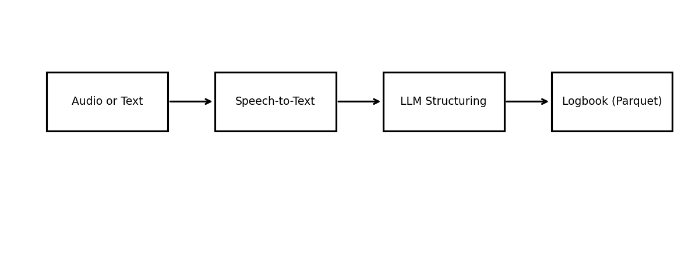
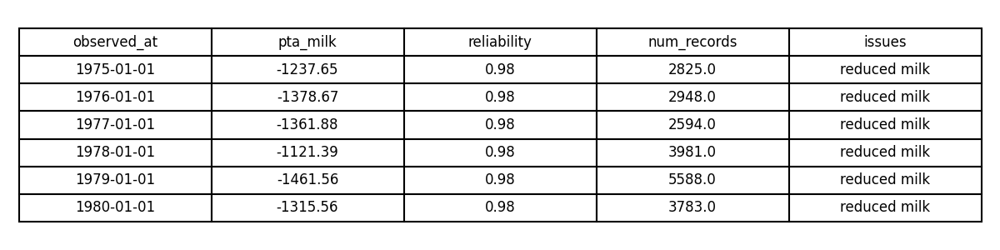
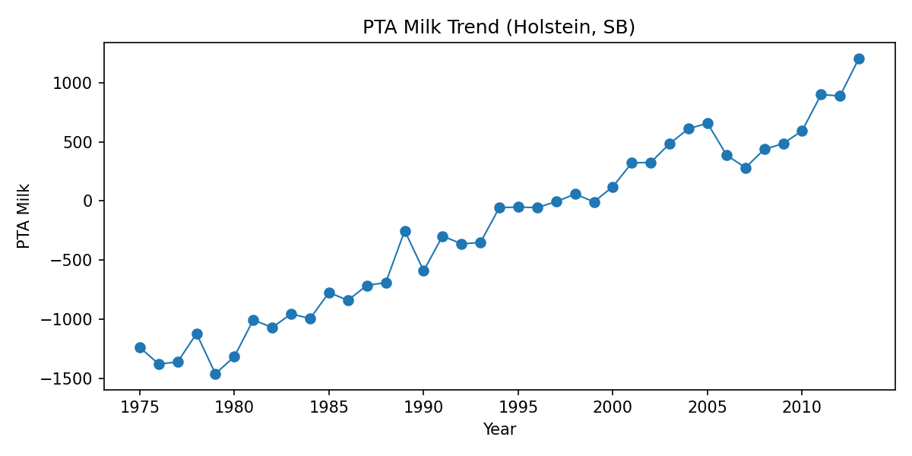
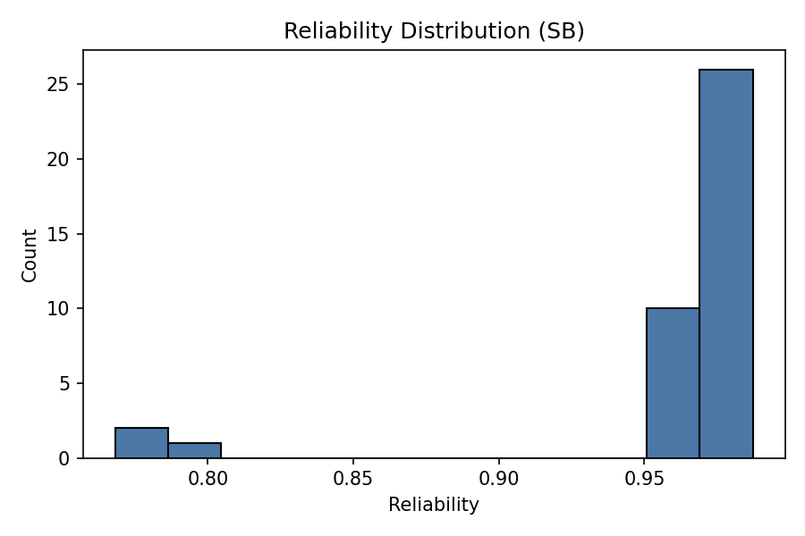
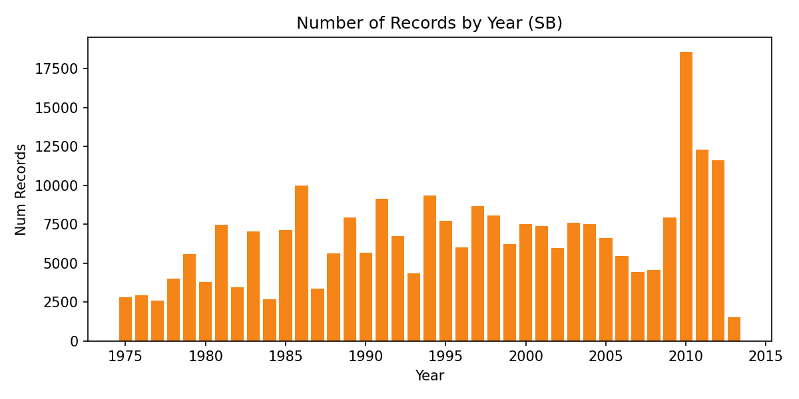
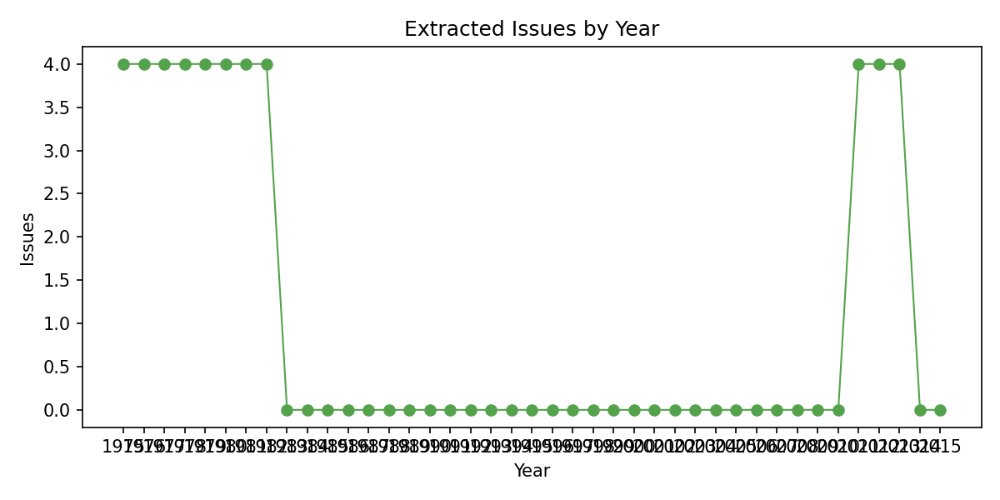
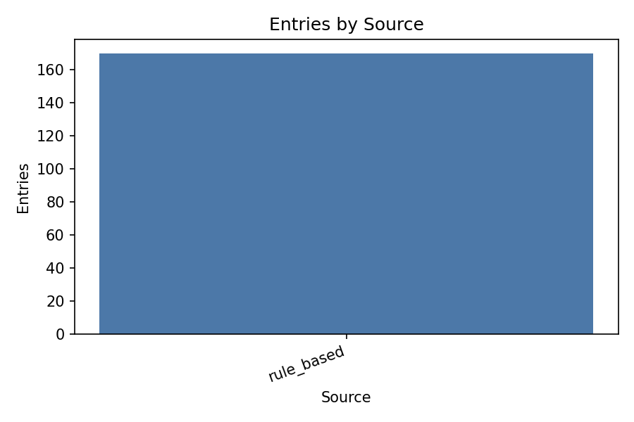
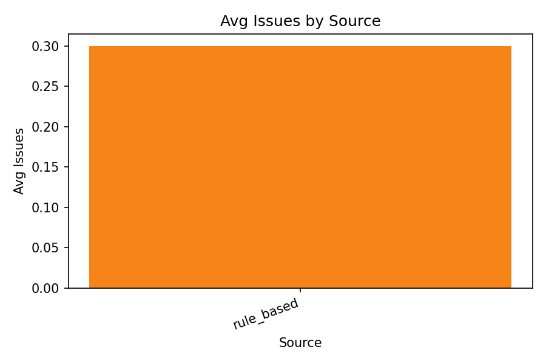
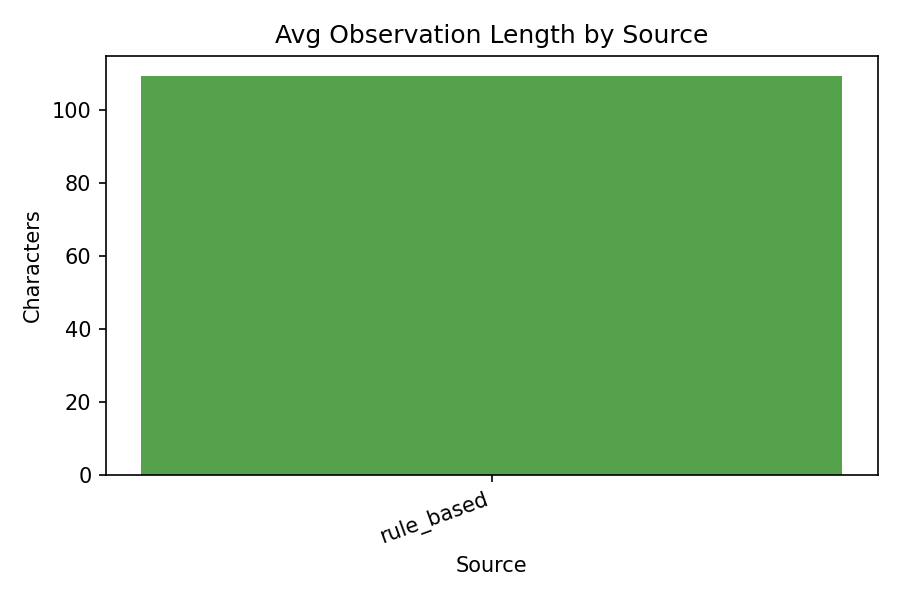
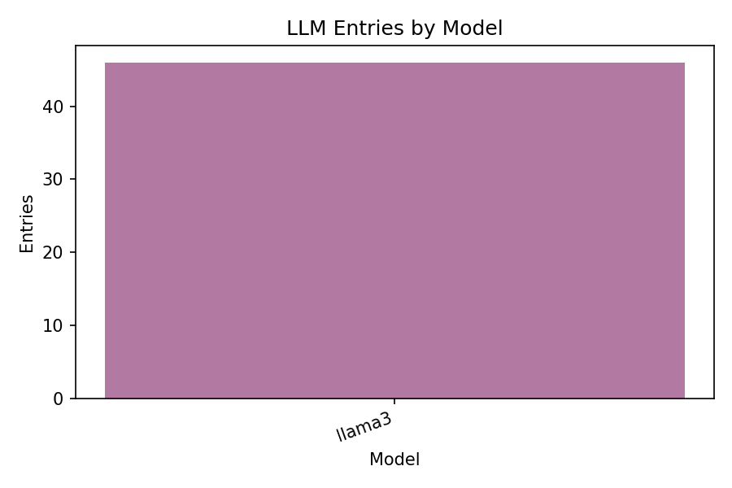

# Automated Dairy Logbook Entry from Speech (LLM)

## 1. Overview

Goal: Convert a farmer's spoken daily observations into structured, searchable logbook entries for later analysis. The pipeline is: speech-to-text (optional local model) -> LLM structuring (local or rule-based) -> logbook storage (Parquet) -> analytics and visualization.

This report includes step-by-step instructions, charts, tables, and commentary using 10 analysis criteria.

## 2. Dataset

Open dataset used:
- Title: Changes in genetic selection differentials and generation intervals in US Holstein dairy cattle as a result of genomic selection
- Source: Figshare (listed on data.gov)
- File: `data/raw/holstein_genomic_selection.csv`
- Link: https://ndownloader.figshare.com/files/44334860

We use this dataset to synthesize daily observations (per year cohort) and demonstrate the logbook pipeline end-to-end.

## 3. System Architecture



## 4. Step-by-step instructions (with screenshots)

Step 1: Create a virtual environment and install dependencies.
```bash
python -m venv .venv
.venv\Scripts\activate
pip install -r requirements.txt
```

Step 2: Generate synthetic transcripts from the dataset.
```bash
python -m scripts.generate_synthetic_transcripts
```

Step 3: Run the pipeline to convert transcripts into structured logbook entries.
```bash
python -m src.main --transcripts data/synthetic/transcripts.txt --mode rule_based
```

Step 4: Create analysis outputs (tables and metrics).
```bash
python -m src.analysis
```

Step 5: Generate charts and visual assets.
```bash
python -m scripts.generate_report_assets
```

Screenshots (generated assets):
- Pipeline diagram: `report_assets/pipeline_overview.png`
- Example table image: `report_assets/sample_table.png`



## 5. Results: Charts and Tables

Charts:





Tables (CSV outputs):
- `report_assets/analysis_metrics.csv`
- `report_assets/sample_entries.csv`
- `report_assets/raw_dataset_summary.csv`
- `report_assets/llm_source_counts.csv`
- `report_assets/llm_quality_by_source.csv`
- `report_assets/llm_model_counts.csv` (only if LLM entries exist)

## 6. 10 analysis criteria with comments

1) LLM usage rate (share of entries from Ollama):
   - See `report_assets/llm_source_counts.csv` and `report_assets/analysis_metrics.csv` (`llm_entries`, `llm_pct`). This confirms how much of the logbook is LLM-structured versus rule-based.

2) Schema validity rate (JSON compliance):
   - The pipeline enforces JSON output (`format: json`) and rejects invalid responses. Any failures surface immediately, preventing malformed entries from entering the log.

3) Field completeness by source:
   - `report_assets/llm_quality_by_source.csv` compares the % of filled fields (PTA, reliability, num_records, observed_at) across `ollama:*` vs `rule_based`.

4) Issue extraction density:
   - `report_assets/llm_quality_by_source.csv` includes `avg_issues`. This measures whether the LLM is overly conservative or overly verbose with health observations.

5) Observation richness:
   - `avg_observation_length` (same CSV) captures how detailed the LLM summaries are, which affects search and downstream analytics.

6) Consistency of normalization:
   - Check that dates are normalized to `YYYY-MM-DD`, and `issues` are returned as a string list. The logbook normalizes `issues` for stability.

7) Hallucination risk controls:
   - The prompt instructs “null/empty” for missing data and uses strict JSON. This reduces invented fields or fabricated values.

8) Traceability:
   - The `source` column stores `ollama:llama3` (or rule-based), enabling audits and A/B comparisons across models.

9) Model-level breakdown:
   - If multiple local models are tested, `report_assets/llm_model_counts.csv` and `llm_entries_by_model.png` show per-model coverage.

10) Throughput and operational fit:
   - Local LLMs add latency but avoid network costs. This is acceptable for daily logbooks and provides privacy for farm observations.

## 7. LLM metrics (with charts)

LLM usage and quality breakdown by source:




Optional model breakdown (if LLM entries exist):


Interpretation:
- `llm_source_counts.csv` shows the share of entries produced by `ollama:llama3` vs rule-based.
- `llm_quality_by_source.csv` compares completeness and richness of structured fields between sources.
- `llm_model_counts.csv` is useful when comparing multiple local models.

## 8. Hadoop and Big Data note

The logbook is stored as Parquet (`data/processed/logbook.parquet`), which is Spark and Hadoop friendly. To scale:
- Upload Parquet files to HDFS.
- Run Spark jobs for batch analytics or SQL queries.

Example (Spark, local mode):
```bash
spark-shell
val df = spark.read.parquet("data/processed/logbook.parquet")
df.groupBy("herd_group").count().show()
```

## 9. Local model usage (optional)

Speech-to-text:
- Install `faster-whisper` or `openai-whisper` and provide `--audio` to `src.main`.

LLM structuring:
- Run a local Ollama model and use `--mode ollama --model llama3`.

## 10. Conclusion

The project demonstrates a full pipeline for automated dairy logbook entry from speech using a local-first stack, structured storage, and analytics. The dataset-driven synthetic transcripts enable reproducible testing, while the Parquet logbook supports big data workflows on Spark or Hadoop.
